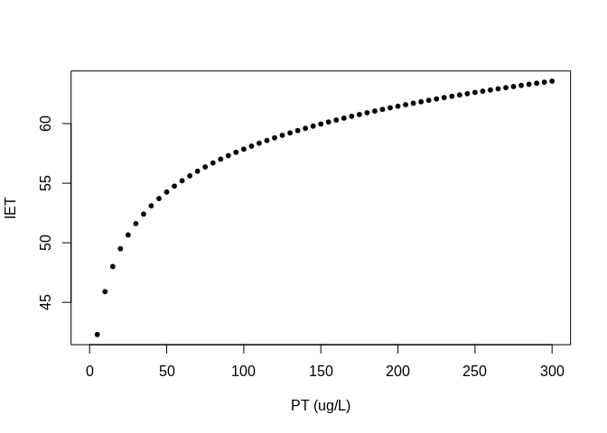

<!-- README.md is generated from README.Rmd. Please edit that file -->
manoSIAR
========

<!-- badges: start -->
<!-- badges: end -->
Este paquete contiene funciones y datos utilizados para trabajar con las bases datos del SIA. De momento no es muy grande pero abarca tareas diversas, tales como las que se usan en las aplicaciónes Shiny (vSIA, hSIA e iSIA), o funciones para hacer gráficas que sirven para hacer informes.

Tiene además un grupo no menor de tablas, incluyendo varias de la base de datos INFAMBIENTALBD del SIA.

Tablas de infambiental (base de datos)
--------------------------------------

Es la base de datos en donde se almacena mucha información concerniente al SIA, especialmente la de monitoreos de aguas y sedimentos, incluyendo lo relativo a los programas de monitoreo (estaciones, cuencas, etc), parámetros (nombres, unidades de medida según matriz, etc.). No incluye datos de aire.

Este paquete cuenta con copias de muchas de las tablas contenidas en esta base de datos, en [clase](https://bookdown.org/jboscomendoza/r-principiantes4/tipos-de-datos.html) [**data.frame**](https://bookdown.org/jboscomendoza/r-principiantes4/data-frames.html) (en verdad, usa una variante más moderna: [tibble](https://r4ds.had.co.nz/tibbles.html)).

Todas las tablas traídas de infambiental se nombran combinando el prefijo *sia\_* con el nombre original. Ejemplo: la tabla `sia_parametro` contiene la misma información que la tabla `parametro` de infambiental.

Como se estila en bases de datos, estas tablas generalmente hay una columna dedicada a un "id": un indentificador numérico que es único para cada entrada, la cual generalmente se llama `id_...` o simplemente `id`. Por ejemplo, en la tabla `sia_parametro`, la columna `id_parametro` identifica a cada parámetro con un número entero positivo. El rol de los identificadores es evitar ambigüedades. Por ejemplo, podemos usar el `id_parametro` para asegurarnos de que trabajamos con el parámetro que nos interesa; en el caso del Fósforo Total figura, el `id_parametro` es 2098:

<!-- ```{r sia_parametro} -->
``` r
library(manoSIAR)
dplyr::filter(sia_parametro, id_parametro == 2098)
```

<table>
<colgroup>
<col width="14%" />
<col width="15%" />
<col width="11%" />
<col width="14%" />
<col width="11%" />
<col width="13%" />
<col width="17%" />
</colgroup>
<thead>
<tr class="header">
<th align="right">id_parametro</th>
<th align="left">parametro</th>
<th align="left">enumerado</th>
<th align="left">nombre_clave</th>
<th align="right">decimales</th>
<th align="left">par_vigente</th>
<th align="left">codigo_airviro</th>
</tr>
</thead>
<tbody>
<tr class="odd">
<td align="right">2098</td>
<td align="left">Fósforo total</td>
<td align="left">FALSE</td>
<td align="left">PT</td>
<td align="right">9</td>
<td align="left">TRUE</td>
<td align="left">NA</td>
</tr>
</tbody>
</table>

> **NOTA**: En general, al exportar datos desde infambiental (i.e.: muestras con valores de parámetros), la regla que uso es usar nombres de `id` descriptivos, para las tablas principales (programas, estaciones, parámetros, etc). Entonces, si bien originalmente hay una columna `id` en la tabla `estacion`, cuando hago la importación se convierte en `id_estacion`. Esto aplica tanto para iSIA como para los datos contenidos en este paquete. De todas formas hay algunas tablas que mantienen los nombres de su

### Buscadores de ID

El paquete incluye buscadores de id para las varias tablas importadas del SIA, usando un texto (i.e.: un Google de ids). El texto o patrón puede ser una expresión regular (la cual se pasa internamente a [`agrepl`](https://www.rdocumentation.org/packages/base/versions/3.6.2/topics/agrep)).

pro\_id: Busca programas en sia\_programa en base al campo nombre\_programa de dicha tabla.

est\_id: Busca estaciones en sia\_estacion en base a los campos codigo\_pto y estacion de dicha tabla.

mat\_id: Busca matrices en sia\_matriz en base al campo nombre de dicha tabla.

uni\_id: Busca unidades en sia\_unidad en base al campo uni\_nombre de dicha tabla.

ins\_id: Busca instituciones en sia\_institucion en base al campo nombre de dicha tabla.

dep\_id: Busca departamentos en sia\_departamento en base al campo dep\_nombre de dicha tabla.

<!--
## Installation

You can install the released version of manoSIAR from [CRAN](https://CRAN.R-project.org) with:

``` r
install.packages("manoSIAR")
```

El paquete se puede descargar desde [GitHub](https://github.com/) mediante los comandos:

``` r
# install.packages("devtools")
devtools::install_github("jumanbar/manoSIAR")
```
-->
Funciones (cálculos)
--------------------

### Índice de estado trófico (IET)

La función `iet` calcula el IET para valores de Fósforo Total (en microgramos por litro):

``` r
library(manoSIAR)
iet(c(25, 50, 75, 250))
#> [1] 50.65856 54.25856 56.36443 62.61750
plot(iet(1:300), ylab = "IET", xlab = "PT (ug/L)", pch = 20)
```



### Tabla con categorías de IET

Toma datos de SIA y

``` r
# d <- filtrar_datos(datos_sia, id_programa = 10L, rango_fechas = 2019)
# iet_tabla(d)
# iet_tabla(d, mes)
# d <- filtrar_datos(datos_sia, id_programa = 10L,
#                    rango_fechas = c("2009-01-01", "2019-12-31"))
# iet_tabla(d, anio)
# iet_tabla(d, anio) %>%
#   dplyr::group_by(anio) %>%
#   dplyr::summarise(n = sum(!is.na(IET)), IET = mean(IET, na.rm = TRUE))
```

------------------------------------------------------------------------

Para desearrolladores
---------------------

> (Sección que, al menos en parte, escribo para refrescar mi propia memoria.)

Este paquete se creó siguiendo de forma aproximada los consejos del libro [R Packages](https://r-pkgs.org/index.html) de Hadley Wickham. El libro entero es importante para entender el desarrollo de paquetes (o la documentación original de CRAN), pero para referencia rápida de quien ya sabe la teoría y sólo tiene que recordar el flujo, ir directamente al capítulo 5: [Fundamental development workflows](https://r-pkgs.org/workflows101.html).

Algunas notas:

-   En funciones no usar `require` o `library`, sino el operador `::`. Ejemplo: `dplyr::filter`. Eso evita afectar el ambiente de trabajo del usuario. La excepción es `ggplot2`, porque se vuelve muy engorroso si no.

-   La función `devtools::load_all()` (Ctrl+Shift+L) sirve para "cargar" el paquete en la sesión, incluyendo funciones, viñetas, y otros códigos. Conviene correrlo cada vez que cambiamos alguna función y queremos probarla, por ejemplo.

-   La función `devtools::document()` (Ctrl+Shift+D) sirve para actualizar los archivos de documentación.
